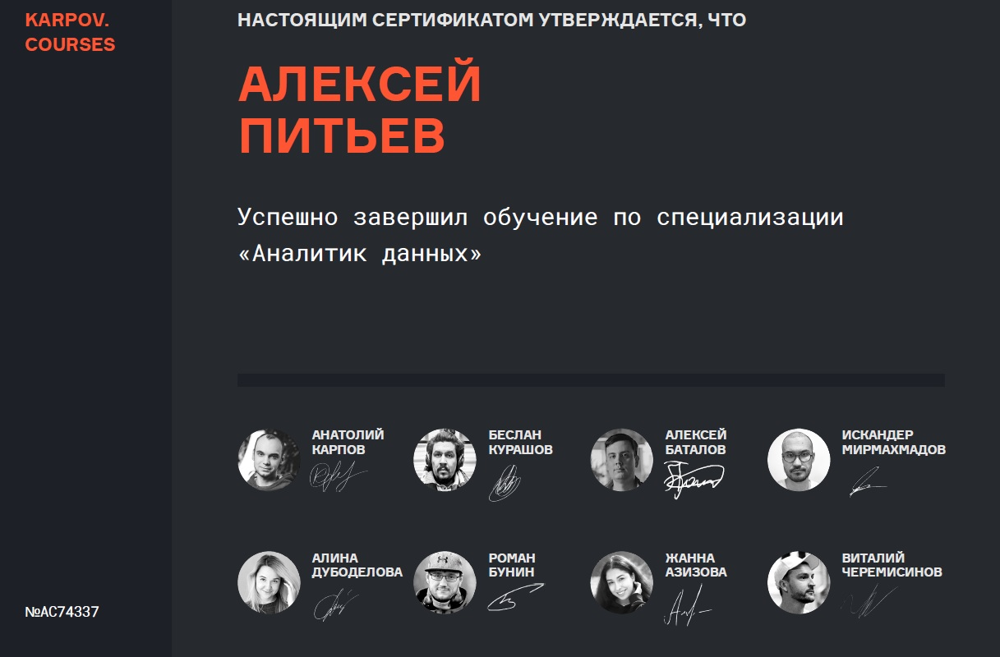
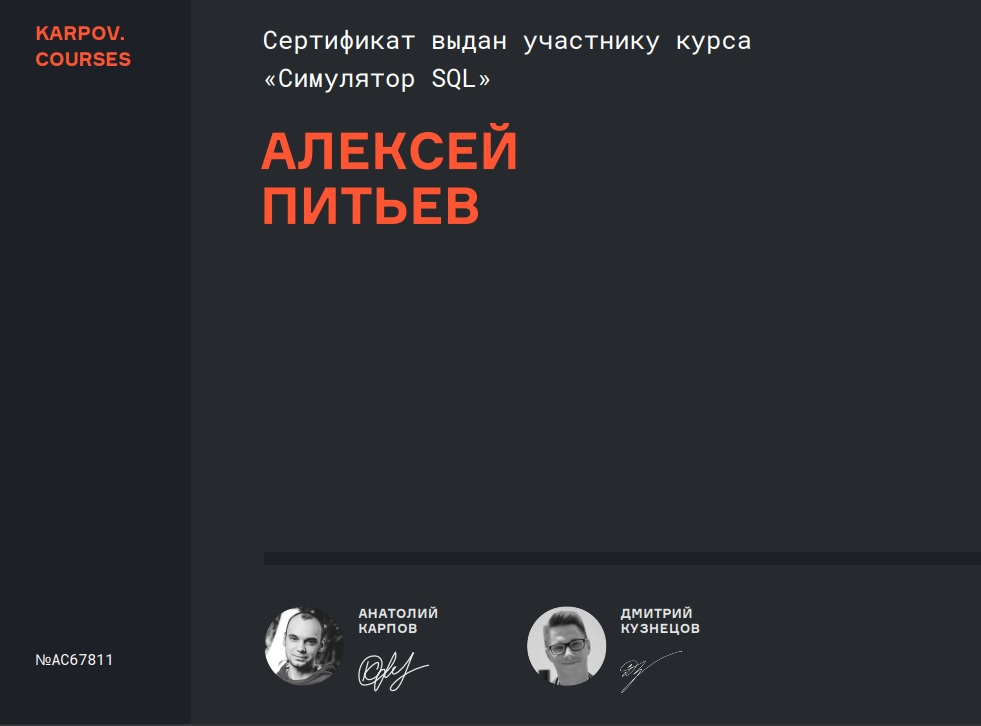
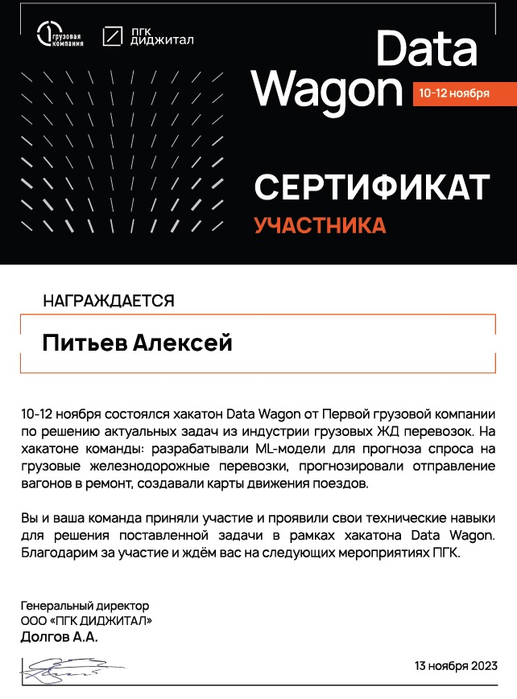
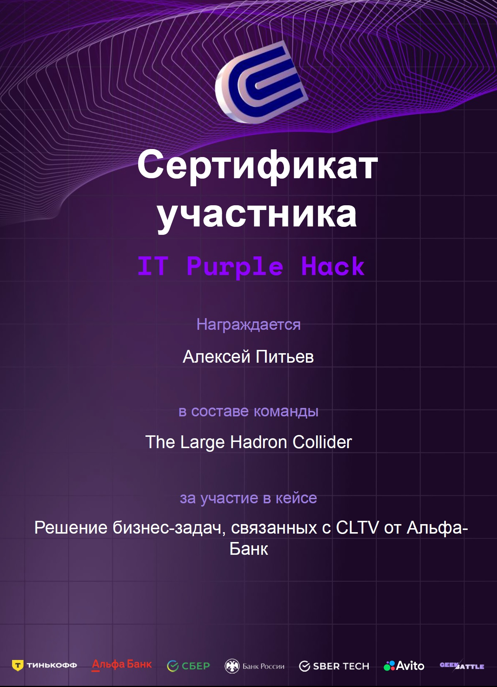

### Полученные сертификаты

курс "Аналитик данных"

  
[Ссылка на сертификат](https://lab.karpov.courses/certificate/2136b186-a820-4b6d-8085-e82ff8ced682/)

[Пройденные модули и темы](DA_ru_sprav.pdf)

Основы анализа данных в Python

  
[Ссылка на сертификат](https://stepik.org/cert/2128295)

Программирование на Python

  
[Ссылка на сертификат](https://stepik.org/cert/1771890)

Функциональное программирование на Python

  
[Ссылка на сертификат](https://stepik.org/cert/2589384)

Регулярные выражения в Python

  
[Ссылка на сертификат](https://stepik.org/cert/2094576)

Инди-курс программирования на Python

  
[Ссылка на сертификат](https://stepik.org/cert/2029144)

Python от Python_Samurai: часть 1

  
[Ссылка на сертификат](https://stepik.org/cert/2511297)

Python от Python_Samurai: часть 2

  
[Ссылка на сертификат](https://stepik.org/cert/2545589)

English for Python == Английский для Питона

  
[Ссылка на сертификат](https://stepik.org/cert/2446670)

Курс «Симулятор SQL»

  
[Ссылка на сертификат](https://lab.karpov.courses/certificate/79276846-96f3-44d9-a4cd-f3503bac22dc/)

Интерактивный тренажер по SQL

  
[Ссылка на сертификат](https://stepik.org/cert/2041692)

Administrating a Microsoft SQL Server 2000

Основы статистики

  
[Ссылка на сертификат](https://stepik.org/cert/1729653)

Основы статистики. Часть 2

  
[Ссылка на сертификат](https://stepik.org/cert/1809967)

Data Science с Глебом Михайловым

  
[Ссылка на сертификат](https://stepik.org/cert/2034093)

Введение в Data Science и машинное обучение

  
[Ссылка на сертификат](https://stepik.org/cert/1968566)

Markdown

  
[Ссылка на сертификат](https://stepik.org/cert/2521813)

Хакатон ПГК Data Wagon

  
[Ссылка на сертификат](sert_Hakaton-PGK.pdf)

Хакатон IT Purple Hack

  
[Ссылка на сертификат](sert_Hakaton-Purple.pdf)

